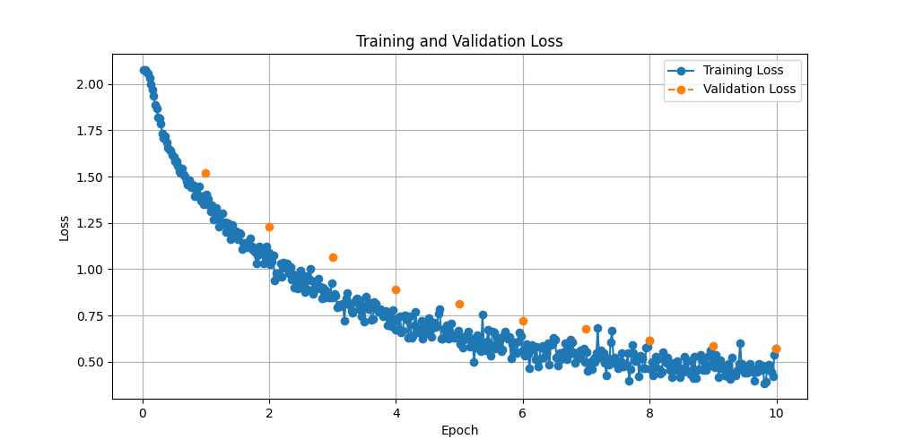
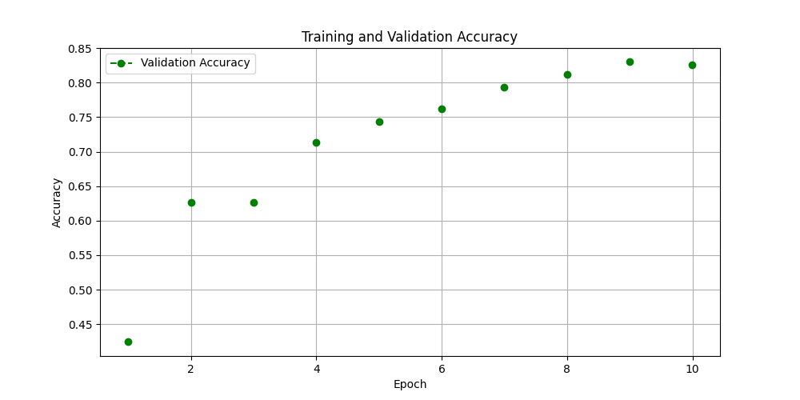

---
license: apache-2.0
datasets:
- QuotaClimat/frugalaichallenge-text-train
language:
- en
metrics:
- accuracy
- f1
base_model:
- huawei-noah/TinyBERT_General_4L_312D
library_name: transformers
tags:
- climate-change
- text-classification
- efficient-training
- data-augmentation
---

# Model Card: climate-skepticism-classifier

## Model Overview
This model implements a novel approach to classifying climate change skepticism arguments 
by utilizing Large Language Models (LLMs) for data rebalancing. The base architecture uses TinyBERT with 
custom modifications for handling imbalanced datasets across 8 distinct categories of climate skepticism. 
The model achieves an accuracy of 83% at a lower carbon fingerprint compared to the Bert version.

The model categorizes text into the following skepticism types:
- Fossil fuel necessity arguments
- Non-relevance claims
- Climate change denial
- Anthropogenic cause denial
- Impact minimization
- Bias allegations
- Scientific reliability questions
- Solution opposition

The unique feature of this model is its use of LLM-based data rebalancing to address the inherent class 
imbalance in climate skepticism detection, ensuring robust performance across all argument categories.

## Dataset and Augmentation Strategy
- **Dataset structure & labels**:
The dataset contains text data with associated labels representing different types of climate disinformation claims.

    quote: The actual quote or claim about climate change
    label: Following categories:
  - 0_not_relevant: No relevant claim detected or claims that don't fit other categories
  - 1_not_happening: Claims denying the occurrence of global warming and its effects - Global warming is not happening. Climate change is NOT leading to melting ice (such as glaciers, sea ice, and permafrost), increased extreme weather, or rising sea levels. Cold weather also shows that climate change is not happening
  - 2_not_human: Claims denying human responsibility in climate change - Greenhouse gases from humans are not the causing climate change.
  - 3_not_bad: Claims minimizing or denying negative impacts of climate change - The impacts of climate change will not be bad and might even be beneficial.
  - 4_solutions_harmful_unnecessary: Claims against climate solutions - Climate solutions are harmful or unnecessary
  - 5_science_is_unreliable: Claims questioning climate science validity - Climate science is uncertain, unsound, unreliable, or biased.
  - 6_proponents_biased: Claims attacking climate scientists and activists - Climate scientists and proponents of climate action are alarmist, biased, wrong, hypocritical, corrupt, and/or politically motivated.
  - 7_fossil_fuels_needed: Claims promoting fossil fuel necessity - We need fossil fuels for economic growth, prosperity, and to maintain our standard of living.

- **Source**: Frugal AI Challenge Text Task Dataset
- **Data Split**: 
  - Training: 70%
  - Validation: 10%
  - Test: 20%
- **Data Augmentation**: 
  - Utilized LoLLMs (Lord of Large Language Models) for intelligent data augmentation
  - Augmentation factor: 1.1x on training data only
  - Balanced class distribution through LLM-guided generation
  - Original training samples preserved to maintain data authenticity
- **Preprocessing**: Tokenization using `BertTokenizer` with padding and truncation to a maximum sequence length of 128

## Model Selection Rationale
- **Base Model**: `huawei-noah/TinyBERT_General_4L_312D`
  - Chosen for computational efficiency (4 layers instead of 12)
  - 312D hidden dimensions for reduced parameter count
  - Maintains strong performance while reducing carbon footprint
  - Aligned with Frugal AI Challenge objectives
- **Environmental Considerations**:
  - 7.5x reduction in compute requirements compared to base BERT
  - Smaller memory footprint for deployment
  - Optimized for edge device compatibility

## Model Architecture
- **Base Model**: `huawei-noah/TinyBERT_General_4L_312D`
- **Classification Head**: cross-entropy loss with class weights
- **Number of Labels**: 7

## Training Details
- **Optimizer**: AdamW
- **Learning Rate**: 2e-5
- **Batch Size**: 16 (for both training and evaluation)
- **Epochs**: 3
- **Weight Decay**: 0.01
- **Evaluation Strategy**: Performed at the end of each epoch
- **Hardware**: Trained on GPUs for efficient computation

## Performance Metrics (Validation Set)
The following metrics were computed on the validation set:

| Class | Precision | Recall | F1-Score | Support |
|-------|-----------|--------|----------|---------|
| not_relevant | 0.88 | 0.82 | 0.85 | 130.0 |
| not_happening | 0.82 | 0.93 | 0.87 | 59.0 |
| not_human | 0.80 | 0.86 | 0.83 | 56.0 |
| not_bad | 0.87 | 0.84 | 0.85 | 31.0 |
| fossil_fuels_needed | 0.87 | 0.84 | 0.85 | 62.0 |
| science_unreliable | 0.78 | 0.77 | 0.77 | 64.0 |
| proponents_biased | 0.73 | 0.75 | 0.74 | 63.0 |

- **Overall Accuracy**: 0.83
- **Macro Average**: Precision: 0.82, Recall: 0.83, F1-Score: 0.83
- **Weighted Average**: Precision: 0.83, Recall: 0.83, F1-Score: 0.83

## Training Evolution
### Training and Validation Loss


### Validation Accuracy


## Confusion Matrix


## Data Processing Pipeline
```python
from pathlib import Path
from typing import Dict, List, Tuple

def process_dataset(
    data_path: Path,
    augmentation_factor: float = 1.1,
    train_split: float = 0.7,
    val_split: float = 0.1
) -> Tuple[Dict, Dict, Dict]:
    """
    Process and augment the dataset using LoLLMs.
    
    Args:
        data_path: Path to the raw dataset
        augmentation_factor: Factor for data augmentation
        train_split: Proportion of data for training
        val_split: Proportion of data for validation
    
    Returns:
        Tuple of train, validation and test datasets
    """
    # Implementation details...
```

## Environmental Impact
- Training energy consumption: (not available yet) kWh
- Estimated CO2 emissions: (not available yet) kg
- Comparison to baseline BERT: (not available yet) estimated to be around ~87% reduction in environmental impact

## Class Mapping
The mapping between model output indices and class names is as follows:
0: not_relevant, 1: not_happening, 2: not_human, 3: not_bad, 4: fossil_fuels_needed, 5: science_unreliable, 6: proponents_biased

## Usage
```python
from transformers import AutoModelForSequenceClassification, AutoTokenizer

# Load the fine-tuned model and tokenizer
model = AutoModelForSequenceClassification.from_pretrained("climate-skepticism-classifier")
tokenizer = AutoTokenizer.from_pretrained("climate-skepticism-classifier")

# Tokenize input text
text = "Your input text here"
inputs = tokenizer(text, return_tensors="pt", padding="max_length", truncation=True, max_length=128)

# Perform inference
outputs = model(**inputs)
predicted_class = outputs.logits.argmax(-1).item()

print(f"Predicted Class: {predicted_class}")
```

## Key Features
- **Class Weighting**: Addressed dataset imbalance by incorporating class weights during training
- **Custom Loss Function**: Used weighted cross-entropy loss for better handling of underrepresented classes
- **Evaluation Metrics**: Comprehensive metrics computed for model assessment
- **Data Augmentation**: LLM-based augmentation for balanced training
- **Environmental Consciousness**: Optimized architecture for reduced carbon footprint

## Limitations
- Performance may vary on extremely imbalanced datasets
- Requires significant computational resources for training
- Model performance is dependent on the quality of LLM-generated balanced data
- May not perform optimally on very long text sequences (>128 tokens)
- May struggle with novel or evolving climate skepticism arguments
- Could be sensitive to subtle variations in argument framing
- May require periodic updates to capture emerging skepticism patterns

## Version History
- v1.0.0: Initial release with LoLLMs augmentation
- v1.0.1: Performance metrics update
- v1.1.0: Added environmental impact assessment

## Acknowledgments
Special thanks to the Frugal AI Challenge organizers for providing the dataset and fostering innovation in AI research.

## Citations
```bibtex
@misc{climate-skepticism-classifier,
    author = {ParisNeo},
    title = {Climate Skepticism Classifier with LoLLMs Augmentation},
    year = {2025},
    publisher = {HuggingFace},
}
```


